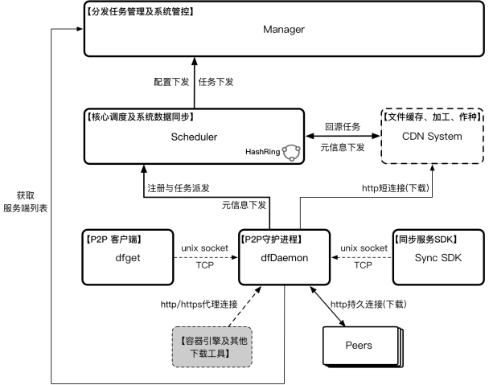
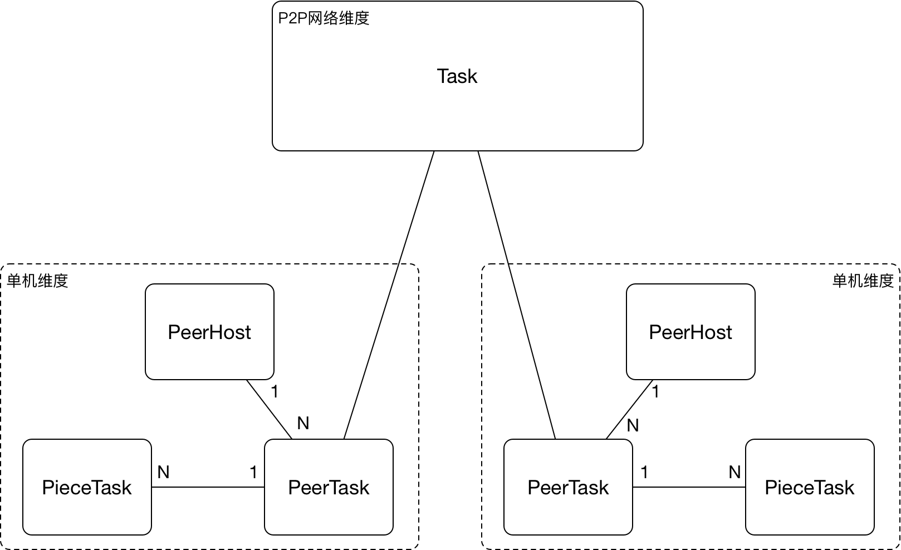
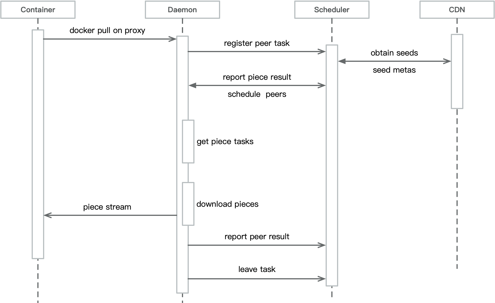

## Dragonfly2 简介

Dragonfly 是一款基于 P2P 的智能镜像和文件分发工具。它旨在提高大规模文件传输的效率和速率，最大限度地利用网络带宽。在应用分发、缓存分发、日志分发和镜像分发等领域被大规模使用。

Dragonfly2 基于 [Dragonfly1.x](https://github.com/dragonflyoss/Dragonfly) 演进而来，在保持 Dragonfly1.x 原有核心能力的基础上，Dragonfly2 在系统架构设计、产品能力、使用场景等几大方向上进行了全面升级。 以下文档都将基于
Dragonfly2 展开。

## Dragonfly2 新特性

如开篇所述， Dragonfly 提供了大规模文件分发一站式解决方案。Dragonfly 提供的基础能力包括：

- **基于 P2P 的文件分发**：通过利用 P2P 技术进行文件传输，它能最大限度地利用每个对等节点（Peer）的带宽资源，以提高下载效率，并节省大量跨机房 带宽，尤其是昂贵的跨境带宽。
- **非侵入式支持所有类型的容器技术**：Dragonfly 可无缝支持多种容器用于分发镜像。
- **机器级别的限速**：除了像许多其他下载工具（例如 wget 和 curl）那样的针对当前下载任务的限速之外，Dragonfly 还支持针对整个机器的限速。
- **被动式 CDN**：这种 CDN 机制可防止重复远程下载。
- **高度一致性**：Dragonfly 可确保所有下载的文件是一致的，即使用户不提供任何检查代码（MD5）。
- **磁盘保护和高效 IO**：预检磁盘空间、延迟同步、以最佳顺序写文件分块、隔离网络-读/磁盘-写等等。
- **自动隔离异常**：Dragonfly 会自动隔离异常节点来提高下载稳定性。
- **支持标准 HTTP 头文件**：支持通过 HTTP 头文件提交鉴权信息。
- **有效的 Registry 鉴权并发控制**：减少对 Registry 鉴权服务的压力。
- **简单易用**：仅需极少的配置。

自17年开源以来，Dragonfly 被许多大规模互联网公司选型并投入生产使用，并在18年10月正式进入 CNCF ，成为中国第三个进入 CNCF 沙箱级别的项目。2020年4月，CNCF 技术监督委员会（TOC）投票决定接受 Dragonfly 作为孵化级别的托管项目。 Dragonfly2 是基于
Dragonfly 多年生产实践经验打磨的下一代产品，它汲取了上一代的优点并针对已知问题做了大量的优化，因此， Dragonfly2 在解决大规模文件分发场景下有着无可比拟的优势。相比于上一代产品，Dragonfly2 带来了以下特性

- **全新架构**：

  Dragonfly1.x 的架构随着日益增长的文件分发业务需求，在稳定性、效率以及安全性等方面逐渐暴露出不足，并随着业务量爆炸式的增长，受到越来越多的挑战，Dragonfly2 通过将 SuperNode 拆分成 Scheduler 和 CDN 两个系统，从根本上解决了调度和存储 IO 之间相互影响的问题。同时支持
  CDN 插件化可按需部署，灵活满足不同场景的实际需要。此外整个系统采用更加高效的GRPC框架框架，并采用自定义一致性hash实现系统间的交互，极大提升了P2P的规模和分发效率。

- **更广泛的应用场景**：

  Dragonfly1.x 只支持HTTP回源协议，针对其他类型的存储（比如HDFS、各云厂商的存储服务、Maven、YUM等等）缺乏适配，从而导致覆盖的场景受到制约。另外文件分发模式目前只支持主动拉取，缺少主动推送以及主动同步等能力。而 Dragonfly2 通
  过统一的回源适配层实现支持各种不同类型存储源的P2P文件分发能力（HDFS、OSS、NAS以及各云厂商的存储服务），同时未来还会支持更多的分发模式：主动拉取、主动推送、实时同步、远程复制、自动预热、跨云传输等等

- **产品能力**：

  当前 Dragonfly1.x 版本并没有提供完善的控制台功能，比如分发任务管理、集群管理、用户管理以及权限控制等，Dragonfly2 通过管控系统支持配置管理、各种分发模式的任务管理、数据视图以及全局管控等功能，使得系统更加简单易用。此外，数据大盘、流量计费等能力也在 2.0 的规划中。

## 技术架构

## 核心模型

## 镜像文件下载流程

